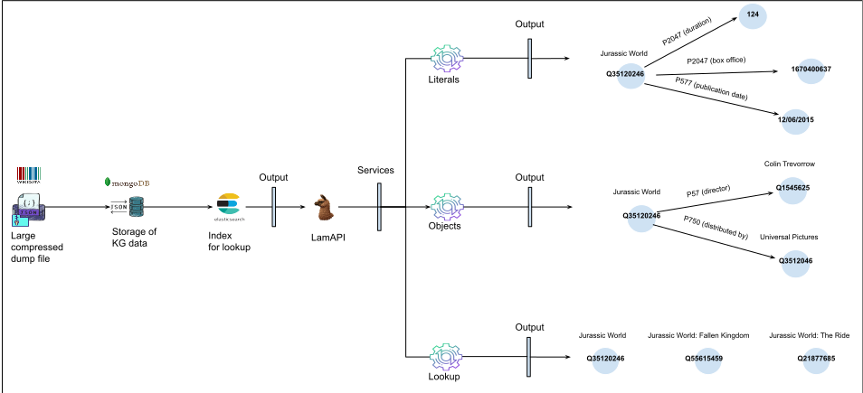

# LamAPI - Wikidata Label Matching API

## Introduction

LamAPI provides a user-friendly interface for streamlined access to Wikidata, offering Full-Text search capabilities and detailed entity analysis.

## Data Processing Pipeline

The following diagram illustrates the data processing pipeline used by LamAPI:

LamAPI processes data from Wikidata through the following stages:

1. **Data Ingestion**: The large compressed Wikidata dump file is ingested into the LamAPI ecosystem.
2. **Data Storage**: The ingested data is then decompressed and stored as JSON in MongoDB for structured and efficient data management.
3. **Data Indexing**: Using Elasticsearch, the stored data is indexed to enable rapid and precise Full-Text search capabilities.
4. **Service Interaction**: LamAPI exposes various services (lookup, objects, literals) that tap into the stored and indexed data to provide detailed information and analysis about entities within Wikidata.

## Core Services

LamAPI offers specialized services designed to cater to various data retrieval and analysis needs:

### Lookup Service

Conducts Full-Text searches across Wikidata to find entities matching input strings, providing quick access to a wealth of structured information.

- **Input**: Search string, e.g., "Jurassic World".
- **Output**: A list of entities related to the search term, including information like IDs and titles from Wikidata.

### Objects Service

Accesses relationships of Wikidata entities, allowing users to explore the connections and context of the data within the knowledge graph.

- **Input**: Entity ID, e.g., `Q35120246` for the film "Jurassic World".
- **Output**: Object data showing properties such as 'director' (P57) -> Colin Trevorrow (`Q1545625`), 'distributed by' (P750) -> Universal Pictures (`Q35120246`).

### Literals Service

Retrieves literal values associated with entities, such as labels, descriptions, and specific property values.

- **Input**: Entity ID, e.g., `Q35120246` for the film "Jurassic World".
- **Output**: Literal data like 'duration' (P2047) -> 124 (minutes), 'publication date' (P577) -> 12/06/2015, and 'box office' (P2041) -> 1670400637.
